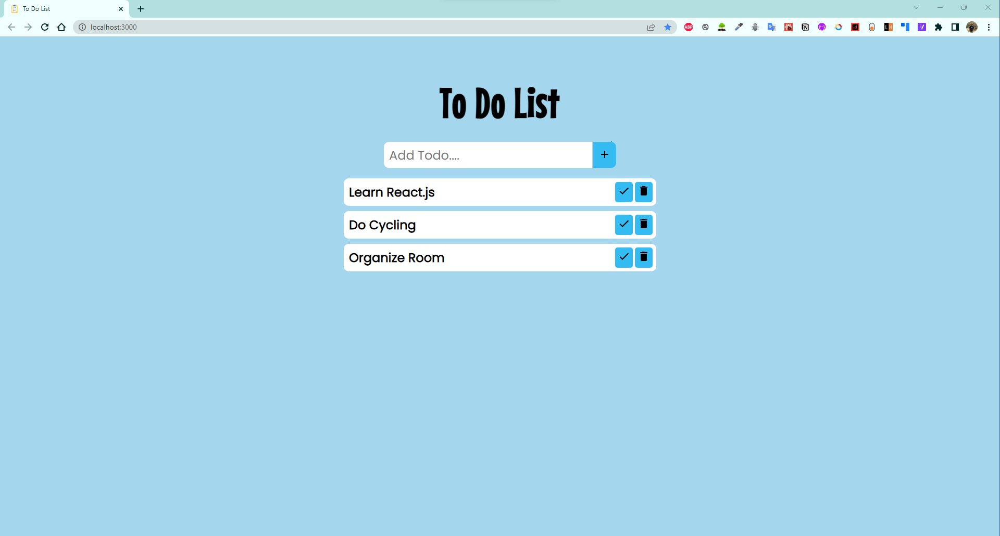

# To Do List Web Application

This is a simple to do list web application that allows users to create, read, update, and delete to do list items. The application is built using the following technologies:

- [React](https://reactjs.org/)
- [React Icons](https://react-icons.github.io/react-icons/)
- [Font Awesome](https://fontawesome.com/)
- [Google Fonts](https://fonts.google.com/)

## Installation

To install the application, clone the repository and run the following commands:

```
npm install
npm start
```

## Screenshots

</img>
